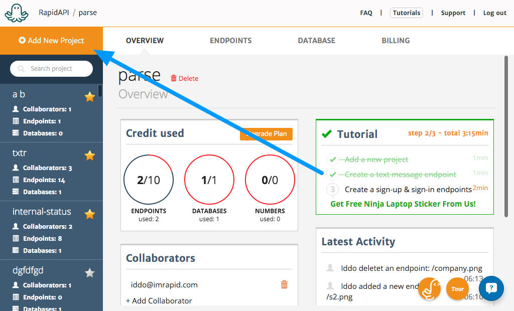
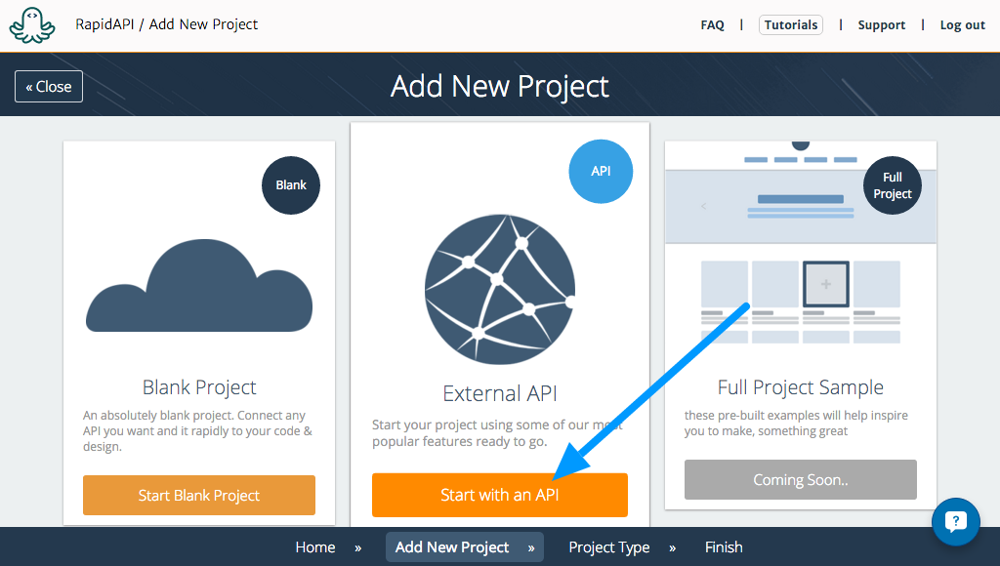
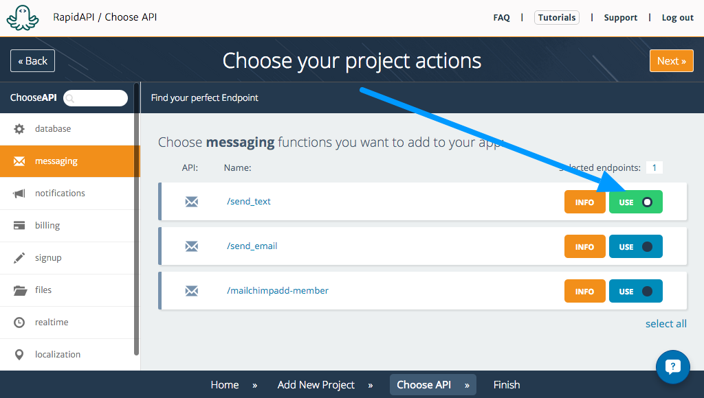
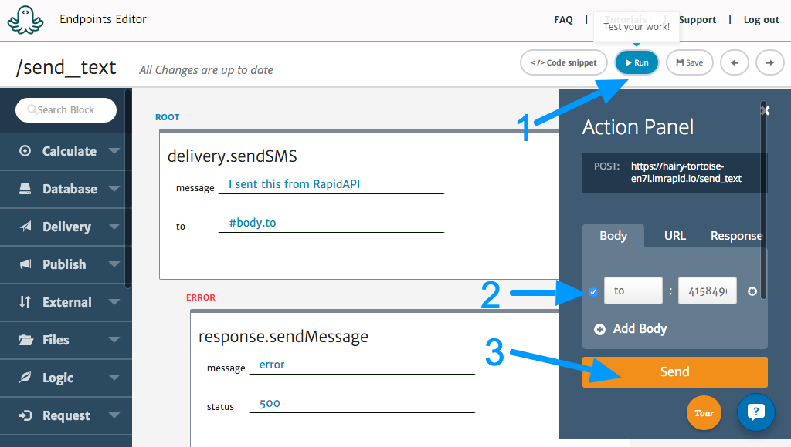
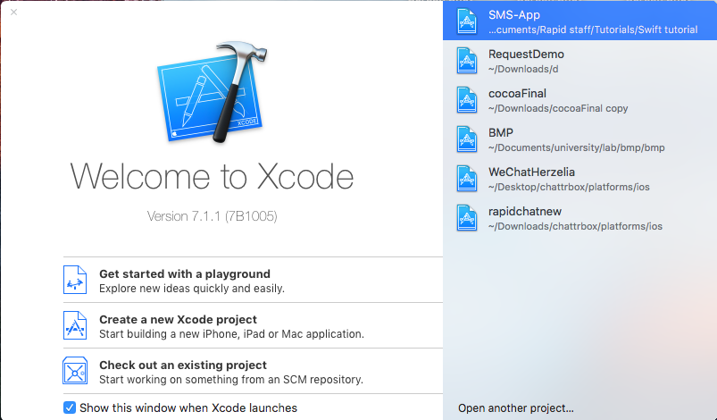
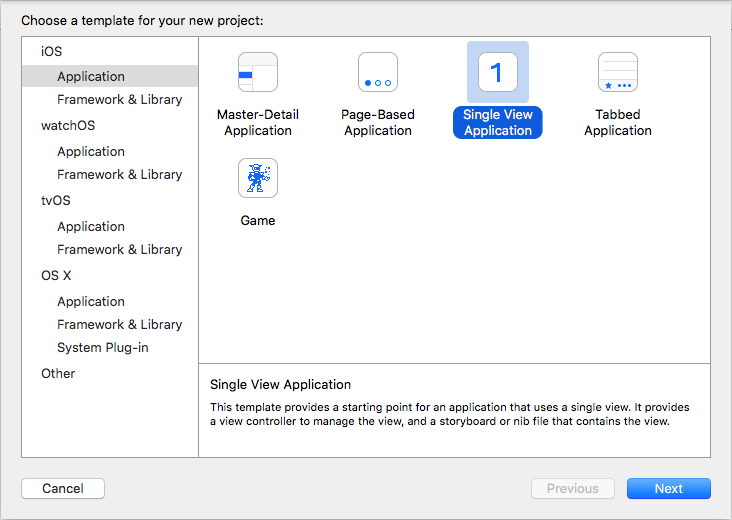
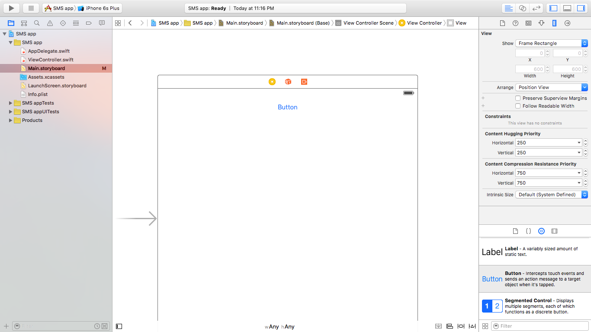
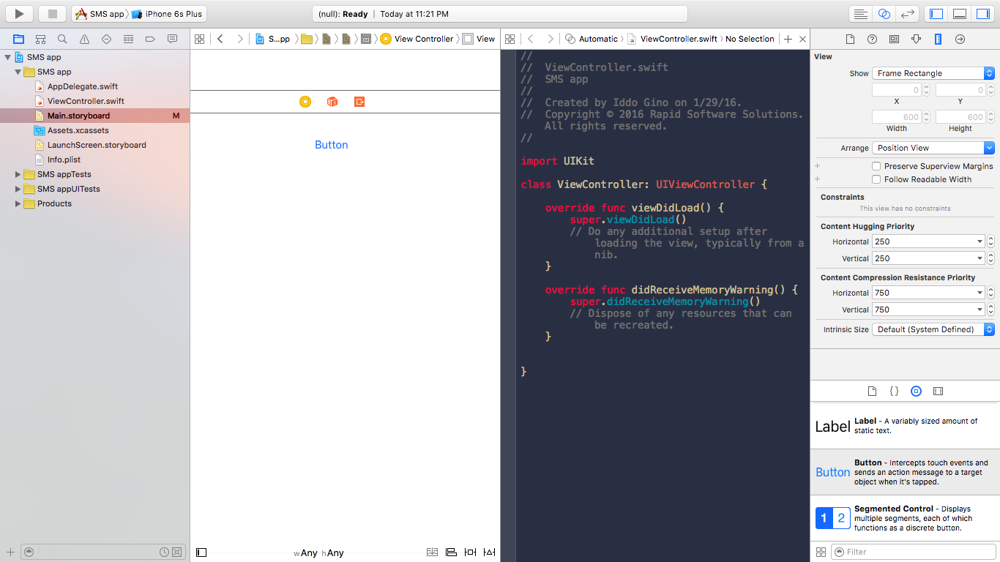
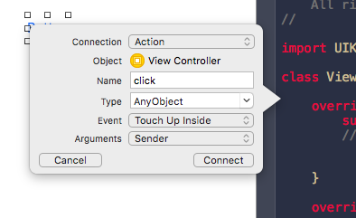
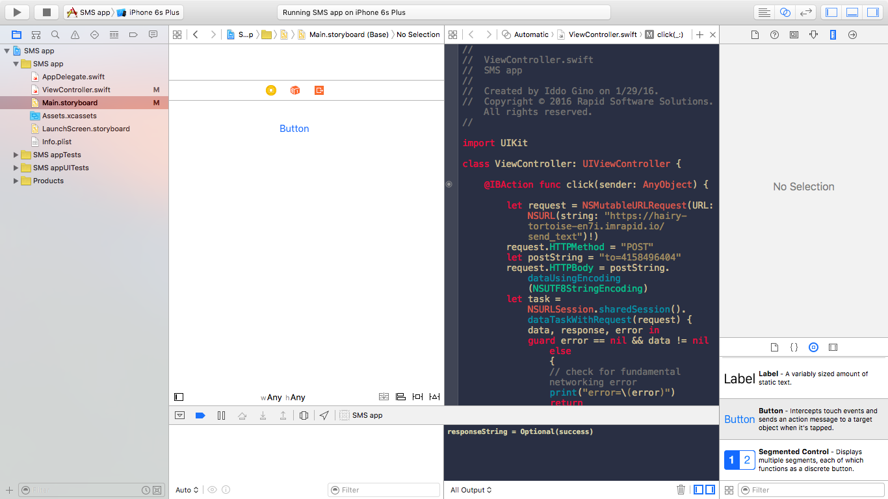

#Connecting RapidAPI to an iOS Swift app

**TL;DR** This tutorial will show you how to create a very simple iOS app that uses RapidAPI to send text messages (SMS) annonymously to people.

##Creating the RpidAPI cloud action

The first step is to create a cloud action to send the text message. This will be super easy with RapidAPI. If you haven't done so already - sign up to [RapidAPI](https://rapidapi.com).

From the dashboard, click **Add new project**.

In the wizard, select the **External API** option. We will use it to select a predefined SMS sending endpoint.

From there, select the **/send_text** action found under messaging.

After that, select **Finish** and name the new project. At this point, we have a fully working text messaging action. To try it out, open the **Endpoints** tab in your project and then open the **/send_text** action.

In there, use the **Run** option to try it. As you may see, the **delivery.sendSMS** block uses the phone number passed in the request body under **to**. So we will put it in the run panel like that:

After pressing **Send** you will recieve the SMS to your phone. Now, let's create a new iOS app and connect it to it.

##Creating the iOS app

Open up Xcode on your computer. On Xcode, select **Create new Xcode project**.

Follow the wizard to create a new project, selecting an **iOS** **Single view application**. Give your new app a name and save it somewhere on your computer.

Start by opening the Main.storyboard file and drag in a button from the left.

From there, switch to the split screen view (click the button that looks like 2 circles on the top right corner of the page).

Once you are in view, hold the **ctrl** button on your keyboard while dragging a line from the button to the code on the left.

In the form that opens up, select:

- Connection: Action
- Name: click
- Event: Touch Up Inside

And click **connect**.

You will see a new funtion was created. It should look like that:

	@IBAction func click(sender: AnyObject) {
        
    }

This function will be called every time the button is tapped. Inside this funnction we will write the code to call the /send_text action we created on RapidAPI earlier.

To do so, we will use the built in `NSMutableURLRequest` to make the call. Here is the code for it, explained line by line:

Create a new request object. Make sure the URL is the same as the one for your project. You can see the URL in the run menu we used to test it in the RapidAPI dashboard easlier.

	let request = NSMutableURLRequest(URL: NSURL(string: "THE_URL_OF_YOUR_CLOUD_ACTION")!)

Set the method to `POST`. All RapidAPI actions use `POST` by default.

	        request.HTTPMethod = "POST"

Set the phone number in the body. Remember the endpoint gets a phone number in the **to** field of the request body. Here we will set it:

	        let postString = "to=YOUR-PHONE-NUMBER"
	        request.HTTPBody = postString.dataUsingEncoding(NSUTF8StringEncoding)

Creating the task object that will actually perform the request, and handle the result:

	        let task = NSURLSession.sharedSession().dataTaskWithRequest(request) { data, response, error in
	            guard error == nil && data != nil else {                                                          // check for fundamental networking error
	                print("error=\(error)")
	                return
	            }
            
            if let httpStatus = response as? NSHTTPURLResponse where httpStatus.statusCode != 200 {           // check for http errors
                print("statusCode should be 200, but is \(httpStatus.statusCode)")
                print("response = \(response)")
            }
            
            let responseString = NSString(data: data!, encoding: NSUTF8StringEncoding)
            print("responseString = \(responseString)")
        }

Running the request:

        task.resume()

All together, the click function looks like that:

	@IBAction func click(sender: AnyObject) {
        
        let request = NSMutableURLRequest(URL: NSURL(string: "https://hairy-tortoise-en7i.imrapid.io/send_text")!)
        request.HTTPMethod = "POST"
        let postString = "to=4158496504"
        request.HTTPBody = postString.dataUsingEncoding(NSUTF8StringEncoding)
        let task = NSURLSession.sharedSession().dataTaskWithRequest(request) { data, response, error in
            guard error == nil && data != nil else {                                                          // check for fundamental networking error
                print("error=\(error)")
                return
            }
            
            if let httpStatus = response as? NSHTTPURLResponse where httpStatus.statusCode != 200 {           // check for http errors
                print("statusCode should be 200, but is \(httpStatus.statusCode)")
                print("response = \(response)")
            }
            
            let responseString = NSString(data: data!, encoding: NSUTF8StringEncoding)
            print("responseString = \(responseString)")
        }
        task.resume()
        
    }

That's it! This is all you need to connect your iOS app to your RapidAPI cloud action. To test it out, click the **Run** button in Xcode. It will build your up and run in on the simulator / on your device (if it is connected).

##Troubleshooting

What to do if this does not work?

1. Make sure the URL you put in is EXACTLY the same as in your RapidAPI dashboard.
2. Make sure the phone number you put in has no spaces, dashes or dots. For US numbers just write *4158596504*. For international numbers, add the international extension like so: **+972***544266782*.
3. If you need more help, don't hesitate to ask us using the support chat in the system, or using the email [support@imrapid.com](mailto:support@imrapid.com).